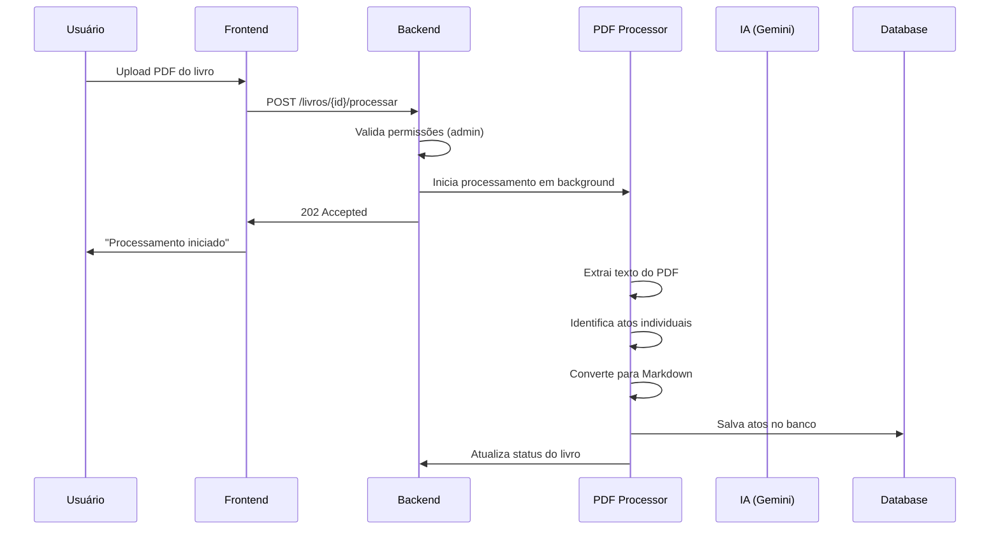
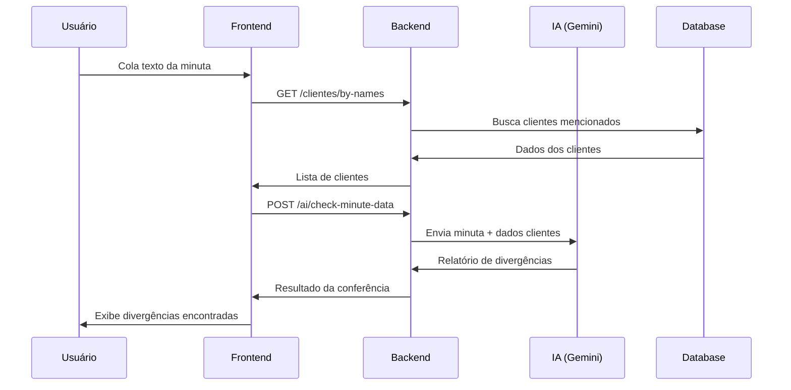
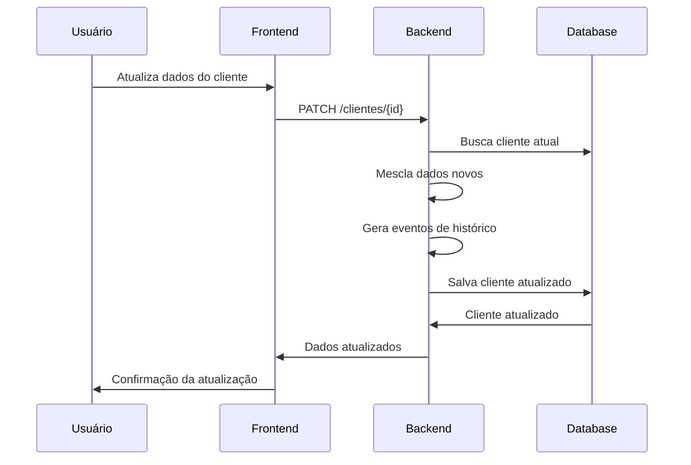

# Arquitetura do Sistema ActNexus

## Visão Geral da Arquitetura

O ActNexus é uma plataforma web moderna para cartórios que integra inteligência artificial para automatizar processos notariais. A arquitetura segue o padrão de separação entre frontend e backend, com integração de IA para processamento de documentos.

```
┌─────────────────┐    ┌─────────────────┐    ┌─────────────────┐
│   Frontend      │    │    Backend      │    │   Serviços IA   │
│   (Next.js)     │◄──►│   (FastAPI)     │◄──►│   (Gemini)      │
│                 │    │                 │    │                 │
│ • Dashboard     │    │ • API REST      │    │ • Processamento │
│ • Componentes   │    │ • Autenticação  │    │ • Extração      │
│ • Estado Local  │    │ • Banco de Dados│    │ • Análise       │
└─────────────────┘    └─────────────────┘    └─────────────────┘
                              │
                              ▼
                       ┌─────────────────┐
                       │ Banco de Dados  │
                       │ (PostgreSQL)    │
                       │                 │
                       │ • Livros        │
                       │ • Atos          │
                       │ • Clientes      │
                       │ • Configurações │
                       └─────────────────┘
```

## Componentes da Arquitetura

### 1. Frontend (Next.js 14)

**Tecnologias:**
- Next.js 14 com App Router
- TypeScript
- Tailwind CSS
- Shadcn/ui
- React Hooks

**Responsabilidades:**
- Interface do usuário
- Gerenciamento de estado local
- Comunicação com API backend
- Validação de formulários
- Roteamento e navegação

**Estrutura de Páginas:**
```
/dashboard
├── /livros              # Gestão de livros
│   ├── /[id]           # Detalhes do livro
│   └── /envio-em-lote  # Upload de PDFs
├── /clientes           # Gestão de clientes
│   └── /[id]          # Perfil do cliente
├── /assistente-ia      # Chat com IA
├── /conferencia-minuta # Conferência de minutas
├── /auditoria-ia       # Logs de uso da IA
└── /configuracoes      # Configurações do sistema
```

### 2. Backend (FastAPI)

**Tecnologias:**
- FastAPI
- SQLAlchemy 2.0 (async)
- Pydantic
- Alembic
- PyMuPDF
- JWT

**Responsabilidades:**
- API RESTful
- Autenticação e autorização
- Validação de dados
- Lógica de negócio
- Processamento de PDFs
- Integração com IA

**Camadas da Aplicação:**
```
┌─────────────────┐
│   API Layer     │  # Endpoints REST
├─────────────────┤
│ Service Layer   │  # Lógica de negócio
├─────────────────┤
│  Model Layer    │  # SQLAlchemy models
├─────────────────┤
│ Database Layer  │  # PostgreSQL
└─────────────────┘
```

### 3. Banco de Dados (PostgreSQL)

**Entidades Principais:**
- **Users**: Usuários do sistema (admin/employee)
- **Livros**: Livros notariais
- **Atos**: Atos individuais dentro dos livros
- **Clientes**: Pessoas físicas e jurídicas
- **Configurações**: Configurações do sistema
- **AuditoriasIA**: Logs de uso da IA

### 4. Serviços de IA (Google Gemini)

**Fluxos Implementados:**
- Processamento de PDF de livros
- Extração de detalhes de atos
- Conferência de minutas
- Geração de qualificações
- Resumo de histórico de clientes
- Assistente conversacional

## Fluxos de Dados Principais

### 1. Fluxo de Processamento de PDF



### 2. Fluxo de Conferência de Minuta



### 3. Fluxo de Gestão de Clientes



## Modelo de Dados

### Diagrama ER Simplificado

```
┌─────────────┐     ┌─────────────┐     ┌─────────────┐
│   Users     │     │   Livros    │     │    Atos     │
├─────────────┤     ├─────────────┤     ├─────────────┤
│ id (PK)     │     │ id (PK)     │     │ id (PK)     │
│ name        │     │ numero      │     │ livro_id(FK)│
│ email       │     │ ano         │     │ numero_ato  │
│ role        │     │ tipo        │     │ tipo_ato    │
│ password    │     │ status      │     │ data_ato    │
└─────────────┘     │ caminho_pdf │     │ partes      │
                    └─────────────┘     │ conteudo_md │
                                        └─────────────┘
                                               │
                                               │
                    ┌─────────────┐     ┌─────────────┐
                    │  Clientes   │     │ Averbacoes  │
                    ├─────────────┤     ├─────────────┤
                    │ id (PK)     │     │ id (PK)     │
                    │ nome        │     │ ato_id (FK) │
                    │ cpf_cnpj    │     │ texto       │
                    │ tipo        │     │ data_averb  │
                    │ contatos    │     │ data_reg    │
                    │ enderecos   │     └─────────────┘
                    │ documentos  │
                    │ eventos     │
                    └─────────────┘
```

### Relacionamentos

1. **Livro → Atos**: Um livro possui muitos atos (1:N)
2. **Ato → Averbações**: Um ato pode ter muitas averbações (1:N)
3. **Cliente → Eventos**: Um cliente possui histórico de eventos (1:N)
4. **Cliente → Contatos**: Um cliente pode ter múltiplos contatos (1:N)
5. **Cliente → Endereços**: Um cliente pode ter múltiplos endereços (1:N)

## Padrões de Arquitetura

### 1. Repository Pattern

```python
# Abstração para acesso a dados
class BaseRepository:
    async def get_by_id(self, id: str) -> Optional[Model]
    async def get_all(self) -> List[Model]
    async def create(self, data: dict) -> Model
    async def update(self, id: str, data: dict) -> Model
    async def delete(self, id: str) -> bool

class LivroRepository(BaseRepository):
    async def get_by_numero_ano(self, numero: int, ano: int) -> Optional[Livro]
    async def get_with_atos(self, id: str) -> Optional[Livro]
```

### 2. Service Layer Pattern

```python
# Lógica de negócio encapsulada
class LivroService:
    def __init__(self, repo: LivroRepository):
        self.repo = repo
    
    async def processar_pdf(self, livro_id: str, user_id: str):
        # Validações de negócio
        # Orquestração de operações
        # Logging e auditoria
```

### 3. Dependency Injection

```python
# FastAPI dependency injection
async def get_current_user(token: str = Depends(oauth2_scheme)) -> User:
    # Validação do token JWT
    return user

async def get_current_admin_user(user: User = Depends(get_current_user)) -> User:
    # Validação de permissões
    if user.role != "admin":
        raise HTTPException(403, "Acesso negado")
    return user
```

## Segurança

### 1. Autenticação

- **JWT (JSON Web Tokens)** para autenticação stateless
- **Refresh tokens** para renovação automática
- **Hash bcrypt** para senhas

### 2. Autorização

- **RBAC (Role-Based Access Control)**
  - **Admin**: Acesso total
  - **Employee**: Acesso limitado

### 3. Validação

- **Pydantic schemas** para validação de entrada
- **SQLAlchemy constraints** no banco de dados
- **Sanitização** de dados de entrada

### 4. Proteção de Endpoints

```python
# Exemplo de proteção por role
@router.post("/processar")
async def processar_pdf(
    current_user: User = Depends(get_current_admin_user)  # Apenas admin
):
    pass

@router.get("/")
async def listar_livros(
    current_user: User = Depends(get_current_user)  # Qualquer usuário autenticado
):
    pass
```

## Performance e Escalabilidade

### 1. Otimizações de Banco

- **Índices** em campos de busca frequente
- **Eager loading** para relacionamentos
- **Connection pooling** para conexões
- **Query optimization** com SQLAlchemy

### 2. Processamento Assíncrono

- **Background tasks** para operações longas
- **AsyncIO** para I/O não-bloqueante
- **Queue system** para processamento em lote

### 3. Cache

- **Redis** para cache de sessões
- **Application-level cache** para dados frequentes
- **CDN** para assets estáticos

### 4. Monitoramento

- **Logs estruturados** (JSON)
- **Métricas de performance**
- **Health checks**
- **Error tracking**

## Integração com IA

### 1. Arquitetura de IA

```
┌─────────────────┐    ┌─────────────────┐    ┌─────────────────┐
│   Frontend      │    │    Backend      │    │   Gemini API    │
│                 │    │                 │    │                 │
│ • Prompts UI    │◄──►│ • Prompt Mgmt   │◄──►│ • Text Analysis │
│ • Results UI    │    │ • Token Tracking│    │ • Generation    │
│ • Config UI     │    │ • Cost Control  │    │ • Classification│
└─────────────────┘    └─────────────────┘    └─────────────────┘
```

### 2. Fluxos de IA

1. **Processamento de PDF**
   - Input: Texto extraído do PDF
   - Output: Estrutura de livro + atos em Markdown

2. **Extração de Detalhes**
   - Input: Conteúdo do ato
   - Output: Dados estruturados (partes, qualificação)

3. **Conferência de Minuta**
   - Input: Texto da minuta + dados dos clientes
   - Output: Relatório de divergências

4. **Assistente Conversacional**
   - Input: Pergunta do usuário
   - Output: Resposta contextualizada com dados internos

### 3. Gerenciamento de Prompts

- **Prompts versionados** e editáveis
- **A/B testing** de prompts
- **Fallback** para prompts padrão
- **Validação** de saída da IA

### 4. Auditoria e Controle

- **Log completo** de todas as chamadas
- **Tracking de custos** por operação
- **Rate limiting** por usuário
- **Análise de performance** dos prompts

## Deploy e DevOps

### 1. Containerização

```dockerfile
# Dockerfile para backend
FROM python:3.11-slim
WORKDIR /app
COPY requirements.txt .
RUN pip install -r requirements.txt
COPY . .
CMD ["uvicorn", "app.main:app", "--host", "0.0.0.0"]
```

### 2. Docker Compose

```yaml
version: '3.8'
services:
  backend:
    build: ./backend
    ports:
      - "8000:8000"
    environment:
      - DATABASE_URL=postgresql://...
    depends_on:
      - db
  
  frontend:
    build: ./frontend
    ports:
      - "3000:3000"
    environment:
      - NEXT_PUBLIC_API_URL=http://backend:8000
  
  db:
    image: postgres:15
    environment:
      - POSTGRES_DB=actnexus
      - POSTGRES_USER=user
      - POSTGRES_PASSWORD=password
    volumes:
      - postgres_data:/var/lib/postgresql/data
```

### 3. CI/CD Pipeline

```yaml
# GitHub Actions example
name: Deploy
on:
  push:
    branches: [main]

jobs:
  test:
    runs-on: ubuntu-latest
    steps:
      - uses: actions/checkout@v3
      - name: Run tests
        run: |
          cd backend
          pip install -r requirements.txt
          pytest
  
  deploy:
    needs: test
    runs-on: ubuntu-latest
    steps:
      - name: Deploy to production
        run: |
          # Deploy commands
```

## Considerações Futuras

### 1. Escalabilidade

- **Microserviços** para componentes específicos
- **Load balancing** para múltiplas instâncias
- **Database sharding** para grandes volumes
- **Event-driven architecture** para desacoplamento

### 2. Funcionalidades Avançadas

- **OCR** para documentos escaneados
- **Assinatura digital** integrada
- **Workflow engine** para processos complexos
- **Relatórios avançados** com BI

### 3. Integrações

- **APIs governamentais** (Receita Federal, etc.)
- **Sistemas de cartório** existentes
- **Ferramentas de backup** e arquivamento
- **Sistemas de pagamento**

Esta arquitetura fornece uma base sólida e escalável para o ActNexus, permitindo crescimento futuro e manutenibilidade do código.